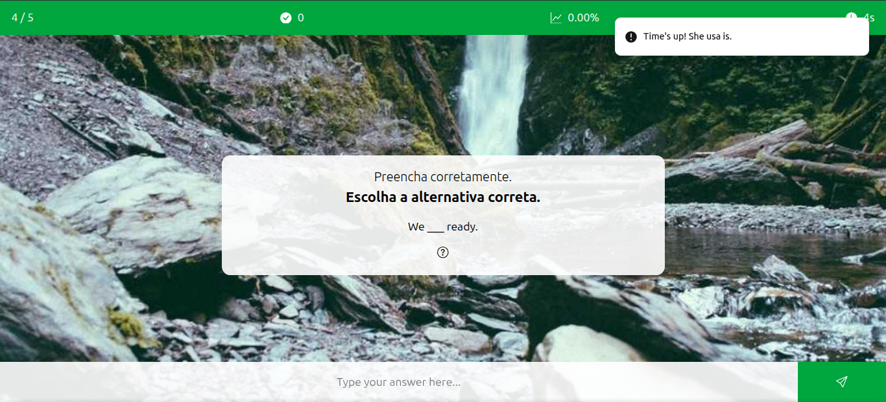

# Quiz Maker




> Quiz Maker is an web app that allows the user to create quizzes manually or by using LLM and play with them.

### Adjustments and improvements

The project is still in development and the next updates are directed to the following tasks:

- [x] Quiz
- [x] Don't allow repeated questions
- [x] Create config form
- [x] Show explanation
- [x] Create a show answer option
- [x] Allow all types of contents in the explanation
- [x] Infinite mode
- [ ] Support for Latex
- [x] Creation form
- [ ] Generation of quizzes with LLM
- [ ] App available in English and Portuguese
- [ ] Suggestions
- [x] Export quizzes
- [ ] Import quizzes
- [ ] Allow selecting which category of questions will be displayed

## Prerequisites

Before getting started, make sure you meet the following requirements for a Node.js project:

- You have the latest LTS version of Node.js and npm installed.
- You are using a compatible operating system (Windows, Linux, or macOS). All three are supported.
- You have read the relevant project documentation or setup guide.

## Installing it

To install it, follow these steps:

```bash
git clone https://github.com/dspedroborges/quiz-maker
cd quiz-maker
npm install
```

## Using it locally

To use it locally, follow these steps:

```bash
npm run dev
```

## Live Demo

You can try it live at: [Live Demo](https://quizmakerproject.vercel.app/)

To run the project:

```bash
npm run build
```

## License

This project is under license. See the file [LICENSE](LICENSE.md) for more details.